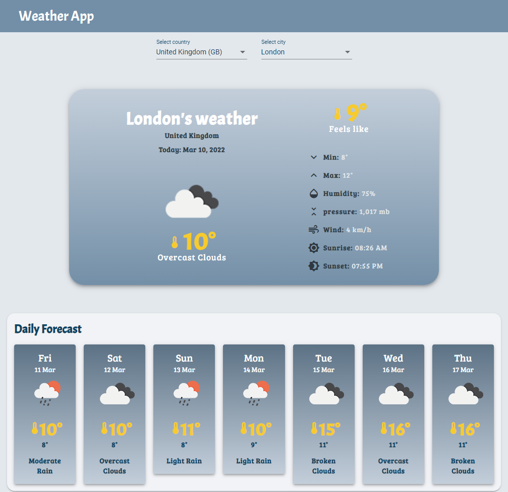

# Weather App
---

 
Weather app is a web app for displaying the weather report from OpenWeatherMap.org .

using Components, Databinding, HTTP, Services, Observables, HTML5, SCSS, Responsiveness features.

## App features
- Display current-today weather
- Display forecast weather
- Country-City Search
- OpenWeather API
## Build with
- Angular CLI v13.2.3
- RxJS features
- Angular Material
- library: country-state-city
- API: OpenWeatherMap